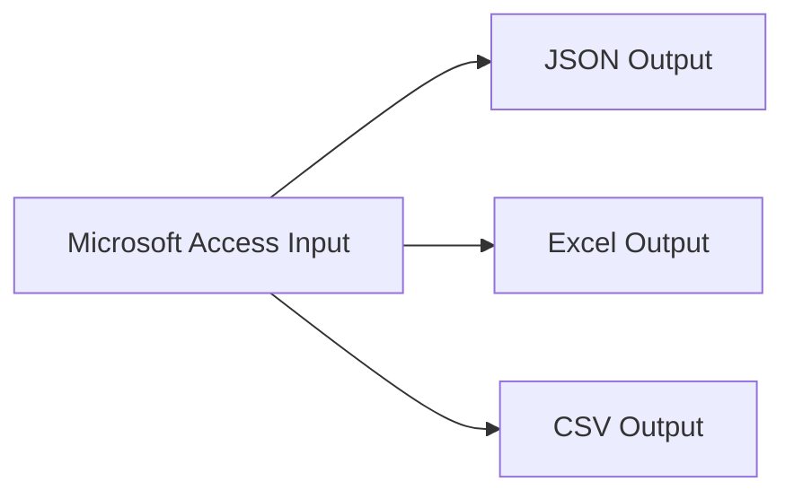
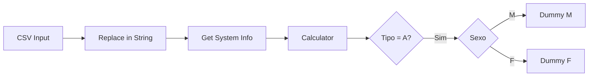
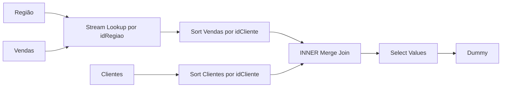

# ETL e Preparação de Dados com Pentaho PDI

## Sobre o projeto

Este repositório reúne atividades práticas que desenvolvi durante uma formação em Engenharia e Análise de Dados promovida pela [MCIO Brasil](https://mciobrasil.org.br/) em parceria com a [Leega](https://leega.com.br/).

No **Módulo 2 — Preparação de Dados**, o treinamento apresentou conceitos de aquisição, limpeza, transformação e carga de dados e utilizou o **Pentaho Data Integration (PDI / Spoon)** para construir fluxos de preparação de dados.

A partir dos exercícios propostos, organizei as transformações em um projeto único para documentar o que pratiquei e tornar o aprendizado mais fácil de visualizar no GitHub.

> Este é um projeto de estudo. As transformações foram criadas a partir das atividades do treinamento e organizadas/revisadas posteriormente para apresentação em portfólio.

## Objetivo

Praticar um fluxo de preparação de dados utilizando diferentes fontes e formatos, aplicando conceitos de ETL e data preparation, como:

- leitura de arquivos Excel, CSV e JSON;
- leitura de dados provenientes do Microsoft Access;
- exportação simultânea para diferentes formatos;
- seleção e remoção de campos;
- substituição e padronização de valores;
- tratamento de valores nulos;
- separação e concatenação de campos;
- cálculo entre datas;
- filtros e direcionamento condicional do fluxo;
- lookup e junção de dados por chaves comuns.

## Transformações desenvolvidas

### 1. Leitura de Excel

Arquivo: `transformacoes/01_leitura_excel.ktr`

Primeiro contato com a construção de uma transformação no Pentaho, realizando a leitura de uma planilha Excel e encaminhando os registros para um step Dummy para validação do fluxo.


### 2. Leitura de JSON

Arquivo: `transformacoes/02_leitura_json.ktr`

Leitura de um arquivo JSON com definição dos campos e tipos de dados e validação dos registros antes das etapas seguintes do processo.


### 3. Exportação para múltiplos formatos

Arquivo: `transformacoes/03_exportacao_multiformato.ktr`

A transformação lê uma tabela originada de um banco Microsoft Access e distribui uma cópia dos registros para três saídas diferentes: JSON, Excel e CSV.



Essa atividade permitiu praticar a diferença entre entrada e saída de dados e o reaproveitamento de um mesmo fluxo para múltiplos destinos.

### 4. Limpeza e transformação de clientes

Arquivo: `transformacoes/04_limpeza_clientes.ktr`

Pipeline de preparação de uma base CSV de clientes. Entre as operações realizadas estão:

- seleção dos campos necessários;
- remoção de caracteres indesejados;
- separação de ID e nome;
- separação da data de nascimento em dia, mês e ano;
- concatenação de ano e mês em `Ano_Mes`;
- tratamento de valores nulos no campo `Tipo`;
- remoção de campos intermediários;
- exportação do resultado para CSV.


### 5. Controle de fluxo de clientes

Arquivo: `transformacoes/05_controle_fluxo_clientes.ktr`

Nesta transformação foram utilizadas regras de negócio para controlar o fluxo dos registros:

- padronização de `Masculino` e `Feminino` para `M` e `F`;
- inclusão da data atual do sistema;
- cálculo da quantidade de dias desde a adesão do cliente;
- filtro dos registros com `Tipo = A`;
- separação do fluxo de acordo com o sexo do cliente.



### 6. Integração de clientes, regiões e vendas

Arquivo: `transformacoes/06_integracao_vendas.ktr`

O fluxo final reúne informações provenientes de diferentes abas de uma planilha de vendas.

A lógica utilizada é:

1. ler dados de clientes, regiões e vendas;
2. enriquecer as vendas com cidade, estado e país por meio de `idRegiao`;
3. ordenar os fluxos pela chave `idCliente`;
4. realizar um `INNER Merge Join` entre clientes e vendas;
5. selecionar os campos necessários para o resultado final.



## Revisão técnica realizada para o portfólio

Ao organizar os arquivos para publicação, revisei as transformações e fiz duas adequações sem alterar os arquivos originais do treinamento:

- substituí caminhos absolutos locais (`C:\\...`) por caminhos relativos ao repositório, facilitando a execução em outra máquina;
- na transformação de integração, ajustei o lookup para relacionar `Vendas[idRegiao]` com `Regiao[idRegiao]`, de acordo com a estrutura da planilha utilizada neste repositório, e depois realizar a junção com clientes por `idCliente`.

Também defini a leitura do arquivo `Clientes.csv` como Windows-1252 nas cópias organizadas para preservar corretamente os caracteres acentuados da base fornecida.

## Estrutura do repositório

```text
etl-pentaho-data-preparation/
├── README.md
├── NOTAS_TECNICAS.md
├── transformacoes/
│   ├── 01_leitura_excel.ktr
│   ├── 02_leitura_json.ktr
│   ├── 03_exportacao_multiformato.ktr
│   ├── 04_limpeza_clientes.ktr
│   ├── 05_controle_fluxo_clientes.ktr
│   └── 06_integracao_vendas.ktr
├── dados/
│   ├── entrada/
│   └── saida/
└── imagens/
```

## Como executar

1. Abra o **Pentaho Data Integration (Spoon)**.
2. Abra um dos arquivos `.ktr` da pasta `transformacoes`.
3. Mantenha a estrutura de pastas do projeto, pois os caminhos dos arquivos foram configurados de forma relativa.
4. Execute a transformação e acompanhe os indicadores de execução em `Step Metrics`.
5. Nas transformações com saída física, confira os arquivos gerados em `dados/saida`.

## Arquivos de saída disponíveis

A transformação de exportação multiformato possui exemplos de saída em:

- `dados/saida/habitantes_exportado.json`
- `dados/saida/habitantes_exportado.xls`
- `dados/saida/habitantes_exportado.csv`

## O que pratiquei neste módulo

- Pentaho Data Integration / Spoon
- ETL e preparação de dados
- CSV, JSON, Excel e Microsoft Access
- Input e Output steps
- Select Values
- Replace in String
- Split Fields
- Concat Fields
- tratamento de nulos
- Get System Info
- Calculator
- Filter Rows
- Switch / Case
- Stream Lookup
- Sort Rows
- Merge Join
- controle e direcionamento de fluxo

## Próximos passos

Como evolução deste estudo, pretendo aplicar os mesmos conceitos em um pipeline com uma base diferente, acrescentando validações de qualidade, tratamento de erros e carga em banco de dados.

## Sobre a formação

Este projeto faz parte dos estudos realizados em uma formação da **Leega**, em parceria com a **MCIO Brasil**.

- Leega: https://leega.com.br/
- MCIO Brasil: https://mciobrasil.org.br/

A publicação tem como objetivo documentar meu aprendizado e demonstrar, de forma prática, as transformações que desenvolvi durante o módulo de Preparação de Dados.

## Observação sobre as bases

Os arquivos de dados utilizados foram disponibilizados ou produzidos durante os exercícios do treinamento. Antes de publicar as bases em um repositório público, é recomendável confirmar se sua redistribuição é permitida. Caso haja dúvida, mantenha no GitHub apenas as transformações `.ktr`, a documentação e imagens dos fluxos, removendo a pasta `dados/entrada`.
