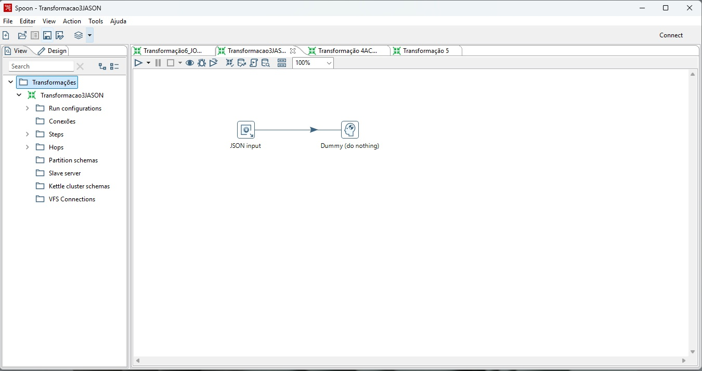
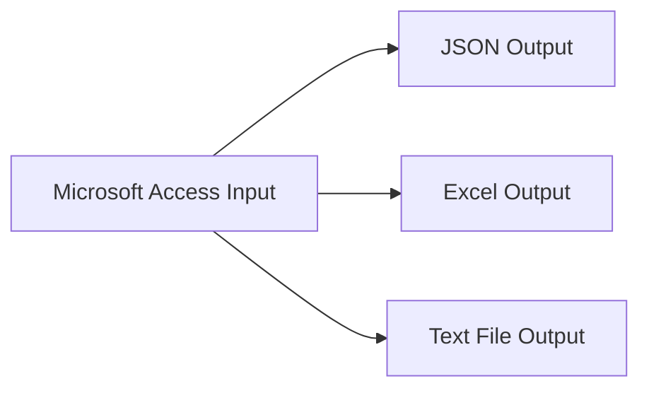
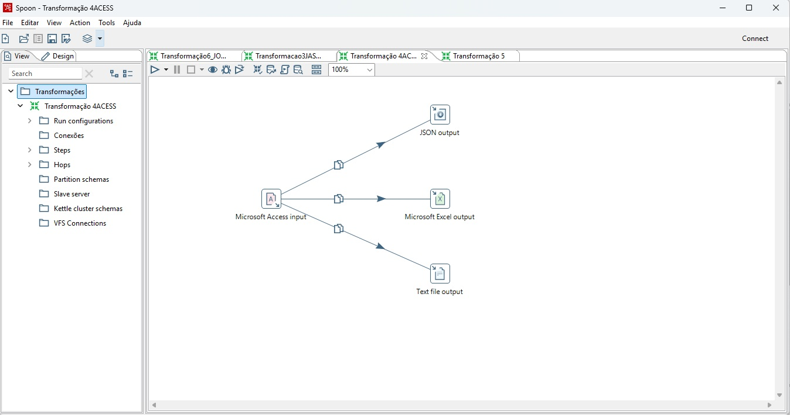
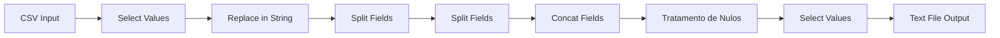
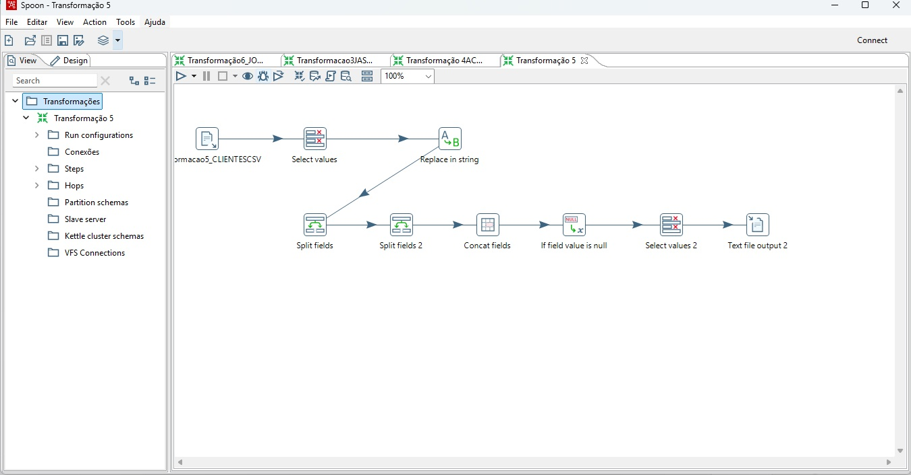
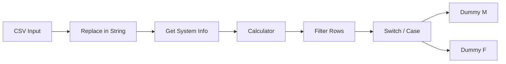
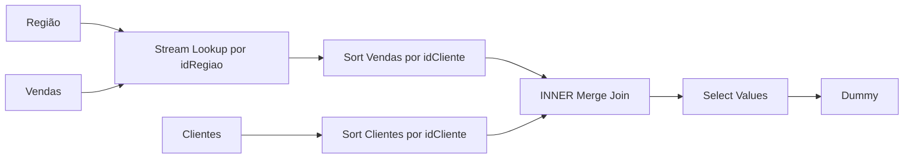
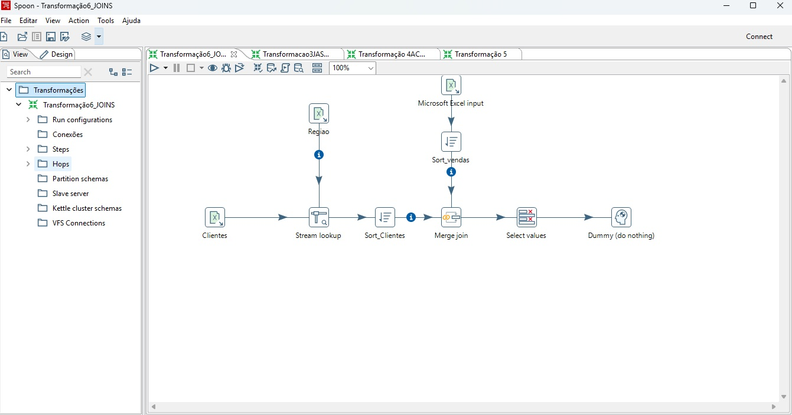

# ETL e Preparação de Dados com Pentaho PDI

## Sobre o projeto

Este repositório reúne exercícios práticos realizados durante o **Módulo 2 – Preparação de Dados** de uma formação em Engenharia e Análise de Dados promovida pela [MCIO Brasil](https://mciobrasil.org.br/) em parceria com a [Leega](https://leega.com.br/).

O módulo apresentou conceitos relacionados à aquisição, limpeza, transformação e carga de dados, utilizando o **Pentaho Data Integration (PDI / Spoon)** para a construção de fluxos de preparação de dados.

Este módulo marcou também o meu **primeiro contato prático com o Pentaho**.

As transformações apresentadas neste repositório são **exercícios propostos pela Leega**, que reproduzi durante o treinamento para aprender a utilizar a ferramenta e aplicar, pela primeira vez, conceitos de preparação de dados e ETL no Pentaho.

Posteriormente, organizei os arquivos em um único repositório para documentar meu processo de aprendizagem e facilitar a visualização dos exercícios no GitHub.

> Este é um projeto de estudo. Os fluxos foram reproduzidos a partir das atividades propostas durante o treinamento e organizados posteriormente para fins de documentação e portfólio.

---

## Objetivo

Praticar operações de preparação de dados utilizando diferentes fontes e formatos, aplicando conceitos apresentados durante o treinamento, como:

- leitura de arquivos Excel, CSV e JSON;
- leitura de dados provenientes do Microsoft Access;
- exportação de dados para diferentes formatos;
- seleção e remoção de campos;
- substituição e padronização de valores;
- tratamento de valores nulos;
- separação e concatenação de campos;
- cálculos entre datas;
- aplicação de filtros;
- controle e direcionamento de fluxo;
- uso de lookup;
- ordenação de registros;
- junção de dados através de chaves comuns.

---

## Transformações reproduzidas durante o treinamento

### 1. Leitura de Excel

Arquivo:

`transformacoes_pentaho/01_leitura_excel.ktr`

Um dos primeiros exercícios realizados no Pentaho consistiu na leitura de uma planilha Excel e no envio dos registros para um step `Dummy`, permitindo validar a entrada dos dados e compreender o funcionamento básico de uma transformação.


---

### 2. Leitura de JSON

Arquivo:

`transformacoes_pentaho/02_leitura_json.ktr`

Neste exercício foi realizada a leitura de um arquivo JSON, com identificação dos campos e tipos de dados antes do envio dos registros para a etapa seguinte da transformação.


### Visualização no Pentaho



---

### 3. Exportação para múltiplos formatos

Arquivo:

`transformacoes_pentaho/03_exportacao_multiformato.ktr`

Neste exercício, uma tabela proveniente de uma base **Microsoft Access** é lida pelo Pentaho e os mesmos registros são direcionados para diferentes formatos de saída.

Foram utilizados:

- JSON;
- Excel;
- arquivo texto/CSV.



O exercício permitiu praticar o uso de steps de entrada e saída e visualizar como uma mesma origem de dados pode alimentar diferentes destinos.

### Visualização no Pentaho



---

### 4. Limpeza e transformação de dados de clientes

Arquivo:

`transformacoes_pentaho/04_limpeza_clientes.ktr`

Neste exercício foi realizada a preparação de uma base CSV de clientes.

Entre as operações praticadas estão:

- seleção dos campos necessários;
- remoção de caracteres indesejados;
- separação do campo contendo ID e nome;
- separação da data de nascimento em dia, mês e ano;
- concatenação de ano e mês em um novo campo;
- tratamento de valores nulos;
- remoção de campos intermediários;
- exportação do resultado tratado para CSV.



### Visualização no Pentaho



---

### 5. Controle de fluxo de clientes

Arquivo:

`transformacoes_pentaho/05_controle_fluxo_clientes.ktr`

Este exercício teve como objetivo praticar o controle do fluxo de registros dentro de uma transformação.

Foram aplicadas operações como:

- padronização dos valores de sexo;
- transformação de `Masculino` e `Feminino` em `M` e `F`;
- inclusão da data atual do sistema;
- cálculo do número de dias desde a adesão do cliente;
- filtragem dos registros de acordo com uma condição;
- direcionamento dos registros para fluxos diferentes.



Esse exercício ajudou a compreender que uma transformação pode não apenas modificar dados, mas também controlar quais registros continuam em cada parte do fluxo.

---

### 6. Integração de clientes, regiões e vendas

Arquivo:

`transformacoes_pentaho/06_integracao_vendas.ktr`

O exercício final trabalha a integração de informações provenientes de diferentes abas de uma planilha.

São utilizadas informações relacionadas a:

- clientes;
- regiões;
- vendas.

A transformação utiliza uma chave em comum para enriquecer os dados de vendas com informações de região e posteriormente realizar a junção com os dados dos clientes.

A lógica do fluxo envolve:

1. leitura dos dados de clientes, regiões e vendas;
2. associação entre vendas e regiões através de `idRegiao`;
3. recuperação de cidade, estado e país através de `Stream Lookup`;
4. ordenação dos dados pela chave `idCliente`;
5. realização de um `INNER Merge Join`;
6. seleção dos campos necessários para o resultado final.



### Visualização no Pentaho



---

## Organização dos arquivos para o GitHub

Para facilitar a visualização e a execução dos exercícios fora do ambiente em que foram originalmente criados, as cópias publicadas neste repositório foram organizadas utilizando caminhos relativos.

Por exemplo:

```text
${Internal.Entry.Current.Directory}/../dados/entrada/
```

Dessa forma, os arquivos não dependem de um caminho específico como `C:\...` existente apenas no computador em que a atividade foi realizada.

Na transformação de integração de vendas, o lookup também foi organizado para relacionar corretamente:

```text
Vendas[idRegiao] → Regiao[idRegiao]
```

Posteriormente, os dados de vendas e clientes são relacionados através de:

```text
Vendas[idCliente] → Clientes[idCliente]
```

---

## Estrutura do repositório

```text
pentaho-data-preparation-leega/
│
├── README.md
│
├── transformacoes_pentaho/
│   ├── 01_leitura_excel.ktr
│   ├── 02_leitura_json.ktr
│   ├── 03_exportacao_multiformato.ktr
│   ├── 04_limpeza_clientes.ktr
│   ├── 05_controle_fluxo_clientes.ktr
│   └── 06_integracao_vendas.ktr
│
├── dados/
│   ├── entrada/
│   └── saida/
│
└── imagens/
    ├── transf3.jpg
    ├── transf4.jpg
    ├── transf5.jpg
    └── transf6.jpg
```

---

## Como executar

Para abrir os exercícios:

1. Abra o **Pentaho Data Integration (Spoon)**.
2. Acesse um dos arquivos `.ktr` disponíveis em `transformacoes_pentaho`.
3. Mantenha a estrutura de pastas do repositório para que os caminhos relativos continuem funcionando.
4. Execute a transformação.
5. Acompanhe o processamento através das métricas apresentadas pelo Pentaho.
6. Nas transformações que geram arquivos físicos, consulte a pasta `dados/saida`.

---

## Exemplos de arquivos de saída

A transformação de exportação para múltiplos formatos gera exemplos de saída como:

```text
dados/saida/habitantes_exportado.json
dados/saida/habitantes_exportado.xls
dados/saida/habitantes_exportado.csv
```

---

## O que pratiquei durante o módulo

Durante meu primeiro contato prático com o Pentaho PDI, tive a oportunidade de utilizar recursos como:

- Pentaho Data Integration;
- Spoon;
- conceitos de ETL;
- preparação de dados;
- CSV;
- JSON;
- Excel;
- Microsoft Access;
- Input steps;
- Output steps;
- Select Values;
- Replace in String;
- Split Fields;
- Concat Fields;
- tratamento de valores nulos;
- Get System Info;
- Calculator;
- Filter Rows;
- Switch / Case;
- Stream Lookup;
- Sort Rows;
- Merge Join;
- controle de fluxo;
- integração de dados através de chaves.

---

## Aprendizado

Como este foi meu primeiro contato com o Pentaho, os exercícios foram importantes para compreender visualmente como os dados percorrem um pipeline.

Ao longo das atividades, pude observar na prática a sequência de um processo de preparação de dados:

```text
Entrada
   ↓
Seleção
   ↓
Limpeza
   ↓
Transformação
   ↓
Integração
   ↓
Saída
```

A experiência também ajudou a relacionar conceitos já estudados em outras ferramentas, como filtros, transformações e joins, com a construção visual de pipelines no Pentaho.

---

## Próximos passos

Como evolução deste aprendizado, pretendo aplicar os conceitos praticados em uma base diferente, construindo um pequeno pipeline próprio e acrescentando etapas como:

- validação da qualidade dos dados;
- tratamento de erros;
- carga em banco de dados;
- automatização de processos de ETL.

---

## Sobre a formação

Os exercícios apresentados neste repositório foram propostos durante uma formação promovida pela **MCIO Brasil em parceria com a Leega**.

- [Leega](https://leega.com.br/)
- [MCIO Brasil](https://mciobrasil.org.br/)

Este repositório tem finalidade educacional e de portfólio, com o objetivo de documentar o que aprendi e pratiquei durante o módulo de **Preparação de Dados**.

---

## Observação sobre as bases

Os arquivos utilizados nos exercícios foram disponibilizados ou produzidos durante o treinamento.

Caso alguma base utilizada esteja sujeita a restrições de redistribuição, ela poderá ser removida do repositório público sem comprometer a documentação das transformações, que permanece disponível através dos arquivos `.ktr`, das imagens e deste README.
